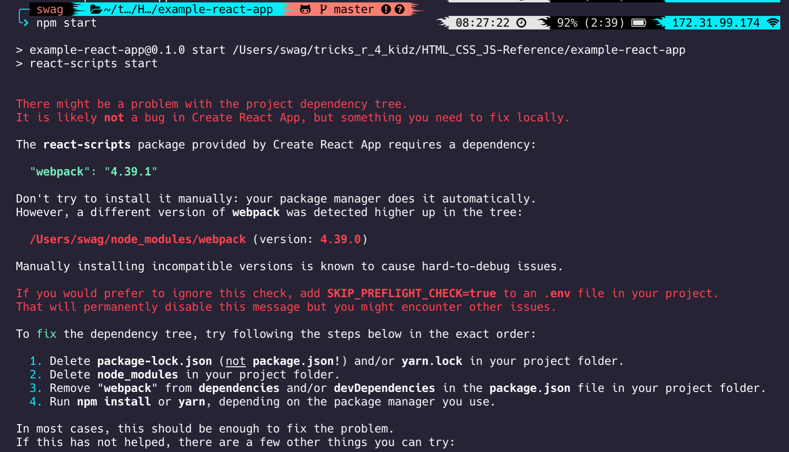

# A quick guide for using node.js with react.js

### What is react.js?

react.js is a library that gives the developer better control of their website. It uses node to local hose your webpage. JSX is similar to a template engine and helps modularize your website.

- [A quick guide for using node.js with react.js](#a-quick-guide-for-using-nodejs-with-reactjs)
    - [What is react.js?](#what-is-reactjs)
  - [Creating and Running a React Demo App](#creating-and-running-a-react-demo-app)
    - [To create a basic react app from the react js template](#to-create-a-basic-react-app-from-the-react-js-template)
    - [To run your new app](#to-run-your-new-app)
      - [Possible Error Message and the Specific Steps to Fix It](#possible-error-message-and-the-specific-steps-to-fix-it)
    - [To Edit Your App](#to-edit-your-app)
      - [React App Intro](#react-app-intro)
      - [Basic React Example](#basic-react-example)
    - [Using JSX](#using-jsx)
      - [JSX Intro](#jsx-intro)
      - [JSX Example](#jsx-example)
      - [JSX Props](#jsx-props)
      - [Lifecycle](#lifecycle)
      - [Event Handlers in React](#event-handlers-in-react)
    - [React console actions](#react-console-actions)

## Creating and Running a React Demo App

### To create a basic react app from the react js template

`$ npx create-react-app [APP NAME]`
`$ cd [APP NAME]`
`$ npm start`

### To run your new app

`$ npm start`

#### Possible Error Message and the Specific Steps to Fix It



If this doesn't work, install yarn and repeat the listed steps. At step 4, run `$ yarn` instead of `$ npm install`

None of this worked for me. I ran `$ brew install webpack` and that worked. Brew, or Homebrew is a package manager for **MAC OS**, similar to linux apt get install.

### To Edit Your App

#### React App Intro

The application is saved in src/App.js
When you use the react js template, you can modify the HTML code marked and build your site there.
In the src directory, index.js renders the index page.

#### Basic React Example

```js
ReactDOM.render(<p>I am a paragraph </p>, document.getElementById("root"));
```

### Using JSX

#### JSX Intro

JSX is a javascript syntax extention. It creates react-style elements bound to variables which can be referenced with curly braces {}

#### JSX Example

This example uses a function which returns a react element. This element is referenced in the `ReactDOM.render()` call.
It displays a blank page with "I am your index page!!!" in h1 tags within the two div tags.

Example:

```JSX
function indexContents() {
  return (
    <div id ="index-contents">
      <h1>I am your index page!!!</h1>
    </div>
  );
}

const mainWebsiteFormat = <div id="page-body">{indexContents()}</div>;

ReactDOM.render(mainWebsiteFormat, document.getElementById("root"));
```

#### JSX Props

Props let the user write a function that creates html code. This is usefull when the html is repeated, especially when a value is changed but the format stays the same. The function turns into a html tag and the attrubutes are referenced in the function.

Example:

```JSX
function FartThePotato (pname){
  return <h3>{pname.potatoType} has been farted</h3>;
}

const element = <FartThePotato potatoType="Japanese Sweet Potato" />;
ReactDOM.render(
  element,
  document.getElementById('root')
);
```

#### Lifecycle

Updating an element live is best done by replacing the element generation with a class and giving it methods. The methods are referred to as "lifecycle methods"

Example from [reactjs docs on state and lifecycle](https://reactjs.org/docs/state-and-lifecycle.html)
This creates a live updating clock

componentDidMount() is run after the element is displayed
componentWillUnmount() is run if the element is removed and the lifecycle ends
setState() lets react know to update the DOM

```JSX
class Clock extends React.Component {
  constructor(props) {
    super(props);
    this.state = {date: new Date()};
  }

  componentDidMount() {
    this.timerID = setInterval(
      () => this.tick(),
      1000
    );
  }

  componentWillUnmount() {
    clearInterval(this.timerID);
  }

  tick() {
    this.setState({
      date: new Date()
    });
  }

  render() {
    return (
      <div>
        <h1>Hello, world!</h1>
        <h2>It is {this.state.date.toLocaleTimeString()}.</h2>
      </div>
    );
  }
}

ReactDOM.render(
  <Clock />,
  document.getElementById('root')
);
```

#### Event Handlers in React

Event handlers are a bit different. Below is an example of a snippit of a function that returns a JSX element. This one is a button.

Example:

```JSX
function clicky() {
  function iwasclicked(e) {
    e.preventDefault();
    console.log("You clicked MEEE");
  }

  return (
    <button onClick={iwasclicked}>
      Click me
    </button>
  );
}
```

### React console actions

-   To Build Your App for Production `$ npm run build`
-   To Test Run the App `$ npm test`
-   Don't do this unless you know what you're doing -- I dont `$ npm run eject`
